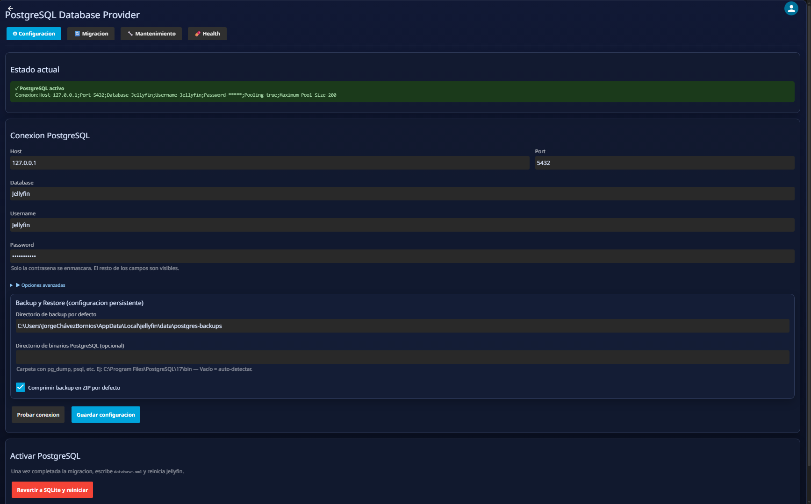
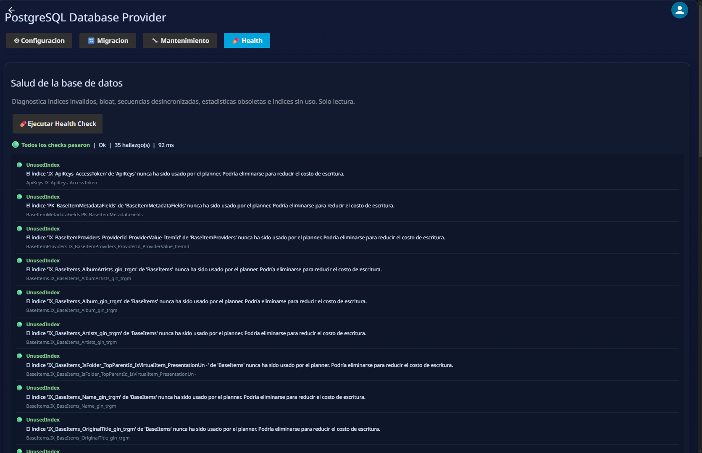
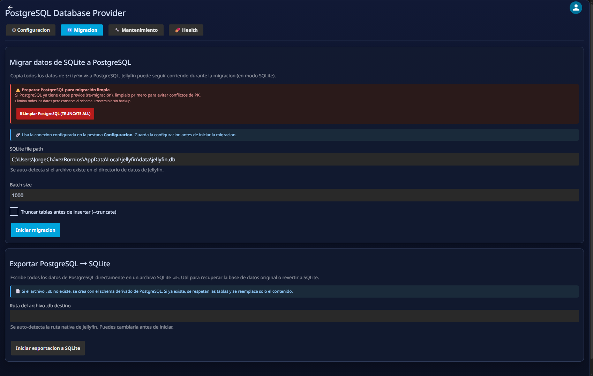
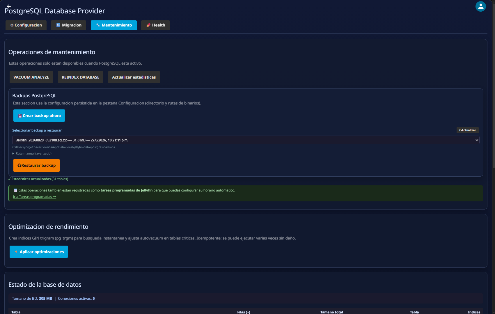

<div align="center">


🌐 &nbsp;[**Español**](README.md)&nbsp; · &nbsp;**English**

<br>

# 🐘 PostgreSQL Database Provider

**Jellyfin plugin** that replaces SQLite with PostgreSQL as the database engine,
without modifying Jellyfin core. Bidirectional migration, near-instant search,
automatic health check, scheduled maintenance and optional JellyTrend integration.

<br>

[](https://github.com/BORNIOS/Jellyfin-Database-Providers-Postgres/commits/main)
[](https://github.com/BORNIOS/Jellyfin-Database-Providers-Postgres/actions)
[](https://jellyfin.org)
[](https://github.com/BORNIOS/Jellyfin-Database-Providers-Postgres/releases/latest)
[](https://github.com/BORNIOS/Jellyfin-Database-Providers-Postgres/releases)
[](https://discord.jellyfin.org)
[](LICENSE)

</div>

---

## ✨ Features

- 🐘 **PostgreSQL as native backend** — EF Core + Npgsql, no Jellyfin core changes required.
- 🔍 **Near-instant search** (< 15 ms typical) with GIN trigram index (`pg_trgm`); automatic fallback to `ILIKE`.
- 🔄 **Bidirectional migration** — SQLite → PostgreSQL and PostgreSQL → SQLite without external tools.
- 🩺 **Automatic health check** at startup: diagnoses bloat, invalid indexes, drifted sequences and slow queries.
- 🛡️ **Error prevention** — EF Core interceptors for upserts, DB error logging and `DateTime.Kind` normalization.
- 🔧 **Automatic optimization** — GIN indexes CONCURRENTLY, autovacuum tuning on critical tables.
- 💾 **Scheduled backups** with `pg_dump`, optional ZIP compression and restore from the UI.
- ⚡ **Optional JellyTrend integration** — recommendations 4-10× faster with optimized native SQL.
- 📊 **Database statistics** — total size, active connections and per-table metrics from the UI.
- 🔁 **One-click rollback to SQLite** from the configuration tab.

## ⚙️ Compatibility

| Component | Version |
|---|---|
| Jellyfin | **10.11.10** |
| PostgreSQL | **13 +** (recommended 16 / 17) |
| .NET | 9.0 |

> ℹ️ The plugin uses `IJellyfinDatabaseProvider` — the same interface as SQLite. No Jellyfin source modifications required.

---

## 🚀 Installation

### Option A — Plugin repository (recommended)

1. In Jellyfin go to **Dashboard → Advanced → Plugin repositories**.
2. Click **Add repository** and use this URL:

   ```
   https://raw.githubusercontent.com/BORNIOS/Jellyfin-Database-Providers-Postgres/main/manifest.json
   ```

3. Save, go to **Catalog**, search **PostgreSQL Database Provider** and **Install**.
4. Restart Jellyfin when prompted.

### Option B — Manual ZIP

1. Download the latest [**Release**](https://github.com/BORNIOS/Jellyfin-Database-Providers-Postgres/releases/latest) ZIP.
2. Extract into your Jellyfin plugins directory.
3. Restart Jellyfin.

> 💡 Common plugin directory locations:
> - **Linux / Docker:** `/config/plugins/`
> - **Windows:** `%LOCALAPPDATA%\jellyfin\plugins\`

---

## 🖥️ Plugin tabs

### ⚙️ Configuration

Manage connection, connection pool and external tool paths.



| Parameter | Description | Default |
|---|---|---|
| Connection string | Full Npgsql connection string | — |
| Schema | PostgreSQL schema | `public` |
| Command timeout | Max EF Core query time (seconds) | `60` |
| Min pool size | Minimum connections kept alive | `4` |
| Max pool size | Maximum connections in pool | `100` |
| Max auto-prepare | Server-side prepared statements (0 = off) | `50` |
| PgBin path | Path to `pg_dump` / `psql` / `pg_restore` | auto-detect |
| Backup directory | Folder for backup files | — |
| Backup compression | Compress backup as ZIP | `true` |

**Recommended flow:**
1. Fill in connection fields and click **Test connection** — returns server version on success.
2. Adjust pool and timeout for your workload.
3. Click **Save configuration**.
4. After migrating data, click **Activate PostgreSQL** and restart.

---

### 🩺 Health Check

Automatic database diagnostics. Runs **10 seconds after startup** and can be triggered manually from the UI.



| Check | Description |
|---|---|
| **Connection** | Verifies PostgreSQL is reachable |
| **Extensions** | `pg_trgm`, `pg_stat_statements` available |
| **Invalid indexes** | Detects and can auto-repair |
| **Table bloat** | Tables with > 20 % dead tuples |
| **Drifted sequences** | Sequences out of range vs actual data |
| **Stale statistics** | Tables without recent `ANALYZE` |
| **Slow queries** | Top queries by cumulative time (`pg_stat_statements`) |

Results use a traffic-light system: `Info` / `Warn` / `Error`. Repairable issues can be fixed in one click from the same card.

---

### 🔄 Migration

Two operations with live progress:



#### SQLite → PostgreSQL

Copies `jellyfin.db` to PostgreSQL table by table.

1. `jellyfin.db` path is auto-detected (`{DataPath}/jellyfin.db`).
2. Adjust **batch size** (default 1000).
3. Enable **Truncate tables before insert** when repeating migration over existing data.
4. Click **Start migration** and follow progress.
5. At 100 %, activate PostgreSQL from the Configuration tab.

> ⚠️ The `--truncate` option runs `TRUNCATE + RESTART IDENTITY + CASCADE` on destination. Use on retries to avoid duplicates; destructive on existing data.

#### PostgreSQL → SQLite

Exports the entire database to a native `.db` file without external tools.

- If `.db` doesn't exist → created with schema derived from PostgreSQL.
- If `.db` already exists → table structure is preserved; only data is replaced (`DELETE` + `INSERT`).
- Written in 10,000-row transactions with `PRAGMA journal_mode=WAL`.

**Use cases:** revert to SQLite, portable backup, local inspection.

---

### 🛠️ Maintenance

Maintenance operations, backups and database statistics.



| Action | Description |
|---|---|
| **VACUUM ANALYZE** | Free space and update planner statistics |
| **REINDEX DATABASE** | Rebuild all indexes |
| **Apply optimizations** | Create 9 GIN indexes CONCURRENTLY + autovacuum tuning |
| **Create backup now** | Generate `.sql` (and optional `.zip`) with `pg_dump` |
| **Restore backup** | Restore from `.sql` or `.zip` |
| **Update statistics** | Show total size, active connections and per-table metrics |

---

## 🔍 Near-instant search

When GIN indexes are active, the plugin exposes its own search endpoint that bypasses EF Core:

- Typical latency **< 15 ms** on medium and large libraries (depends on hardware and client).
- Searches by item name, path and type.
- **Automatic fallback** to `ILIKE` if GIN indexes don't exist yet.
- Activated from **Maintenance → Apply optimizations**.

---

## 🔁 Activate / Deactivate PostgreSQL

### Activate PostgreSQL

1. Configure and test the connection in the **Configuration** tab.
2. Migrate data (**Migration → SQLite → PostgreSQL**).
3. Click **Activate PostgreSQL** and confirm the restart.

Result: `database.xml` is written in `PLUGIN_PROVIDER` mode pointing to this plugin.

### Roll back to SQLite

1. In **Configuration** click **Deactivate / Revert to SQLite**.
2. The plugin removes `database.xml`.
3. Restart Jellyfin.

When to roll back: PostgreSQL connectivity failure, urgent maintenance, incomplete migration.

---

## 💾 Backups

### Configure

In **Configuration**:
- **PgBin path** — path to `pg_dump`/`psql`/`pg_restore`. Leave empty to use system PATH.
- **Backup directory** — destination folder.
- **Backup compression** — enable ZIP of the `.sql`.

### Manual

In **Maintenance**: **Create backup now** / **Restore backup** (accepts `.sql` or `.zip`).

---

## 📅 Scheduled tasks

| Task | Default | Description |
|---|---|---|
| **PostgreSQL Backup** | Daily 02:00 | Backup with `pg_dump` |
| **PostgreSQL VACUUM ANALYZE** | Sunday 03:00 | Free space and update statistics |
| **PostgreSQL REINDEX DATABASE** | Sunday 04:00 | Rebuild all indexes |
| **Optimize GIN Indexes** | Sunday 05:00 | Keep GIN trigram indexes fresh |

> ⚠️ Avoid overlapping REINDEX, VACUUM and Backup in the same time window.

---

## ⚡ JellyTrend integration

If you have [**JellyTrend**](https://github.com/BORNIOS/JellyTrend) installed, the recommendation engine automatically detects this plugin and replaces `ILibraryManager` queries with optimized native SQL:

| Engine | Behavior |
|---|---|
| **SQLite** (without this plugin) | `ILibraryManager` — compatible with any installation |
| **PostgreSQL** (with this plugin) | Direct SQL with native `&&` array operator + GIN indexes — **4-10× faster** |

> ✅ No manual setup needed. If both plugins are installed, the integration activates automatically.

---

## ✅ Post-migration checklist

1. Login works with existing users.
2. Playback progress updating correctly.
3. Key row counts validated (UserData, Users, BaseItems).
4. No PostgreSQL connection errors in Jellyfin logs.
5. Health Check run without errors (`Warn` acceptable, `Error` requires action).
6. Manual backup tested at least once.
7. GIN indexes applied (**Maintenance → Apply optimizations**).

---

## ❓ FAQ

<details>
<summary><b>I installed the plugin but data was not migrated.</b></summary>

Expected. Run migration from **Migration → SQLite → PostgreSQL**, then activate PostgreSQL from **Configuration**.
</details>

<details>
<summary><b>Migration fails or gives odd results on retries.</b></summary>

Enable **Truncate tables before insert** to reset destination tables before inserting. Destructive on existing PostgreSQL data, but guarantees a clean result.
</details>

<details>
<summary><b>Can I edit database.xml manually?</b></summary>

Yes, but the plugin UI is recommended to avoid formatting errors.
</details>

<details>
<summary><b>What happens if I export to SQLite and the .db file already exists?</b></summary>

The plugin preserves the table structure and replaces only the data (DELETE + INSERT). The file is not dropped or recreated.
</details>

<details>
<summary><b>Does the fast search require client changes?</b></summary>

No. It is a server-side endpoint. The plugin UI uses it internally when PostgreSQL is active and GIN indexes exist.
</details>

<details>
<summary><b>Why do timestamps show UTC instead of my timezone?</b></summary>

Earlier versions used the global `Npgsql.EnableLegacyTimestampBehavior` switch which forced UTC on all reads. Since v2.0.0.0 this was replaced by `DateTimeKindNormalizingInterceptor`, which only normalizes write parameters with `Kind=Unspecified`, respecting the PostgreSQL server timezone on reads.
</details>

---

## 🤝 Community

Questions or feedback? Open an [issue](https://github.com/BORNIOS/Jellyfin-Database-Providers-Postgres/issues) or join the official Jellyfin community:

[](https://discord.jellyfin.org)
[](https://www.reddit.com/r/jellyfin)

---

<div align="center">

Made with ❤️ for the Jellyfin community &nbsp;·&nbsp; [⭐ Star on GitHub](https://github.com/BORNIOS/Jellyfin-Database-Providers-Postgres)

</div>
