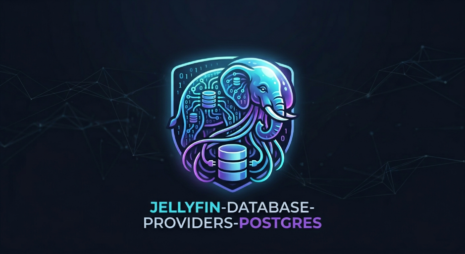
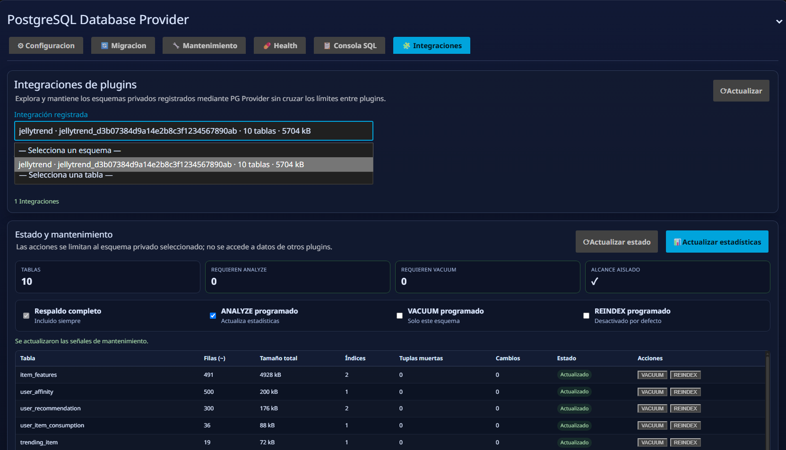
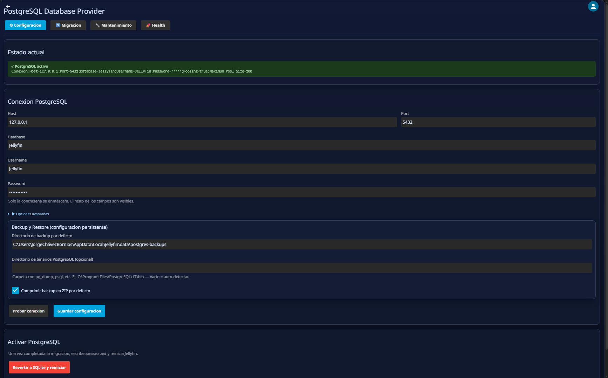
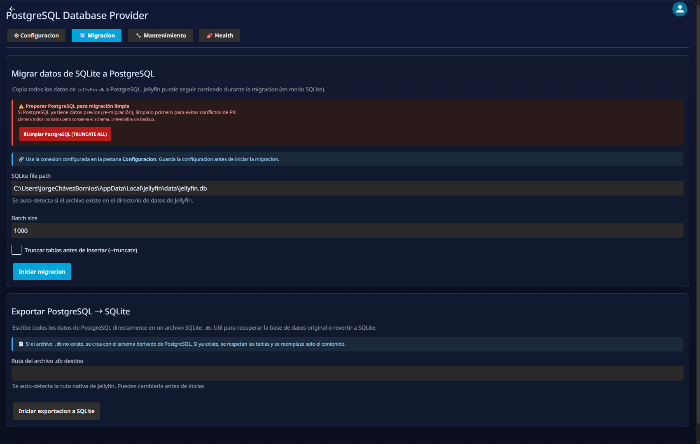
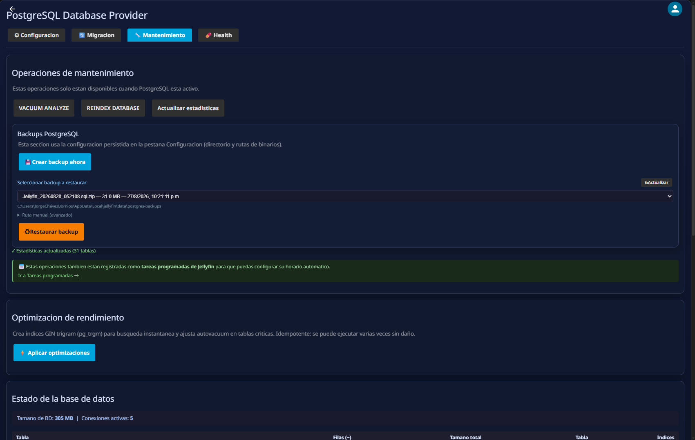
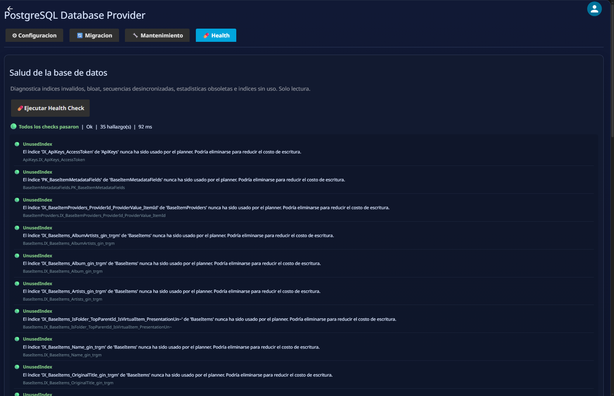
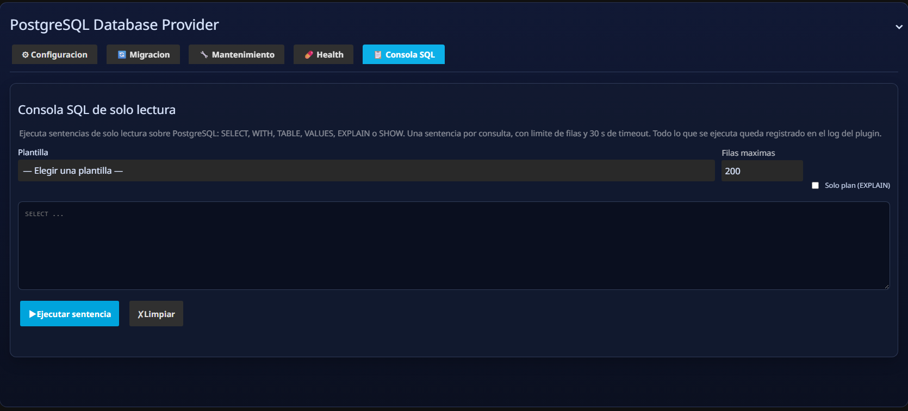

<div align="center">



🌐 &nbsp;[**Español**](README.md)&nbsp; · &nbsp;**English**

<br>

# 🐘 PostgreSQL Database Provider

**Jellyfin plugin** that replaces SQLite with PostgreSQL as the database engine,
without modifying Jellyfin core. Bidirectional migration, near-instant search,
automatic health check, scheduled maintenance and optional JellyTrend integration.

<br>

[](https://github.com/BORNIOS/Jellyfin-Database-Providers-Postgres/commits/main)
[](https://github.com/BORNIOS/Jellyfin-Database-Providers-Postgres/actions)
[](https://jellyfin.org)
[](https://github.com/BORNIOS/Jellyfin-Database-Providers-Postgres/releases/latest)
[](https://github.com/BORNIOS/Jellyfin-Database-Providers-Postgres/releases)
[](https://discord.jellyfin.org)
[](LICENSE)

</div>

> **v3 / Jellyfin 12.1:** requires .NET 10 and PostgreSQL 16+. Read the [upgrade and test guide (Spanish)](docs/JELLYFIN-12.1.md) before replacing the provider.
>
> **Coming from Jellyfin 10.11.x on PostgreSQL?** Follow the [10.11.x → 12.x migration manual](docs/migration-10.11-to-12.en.md): you need plugin **2.0.1** to export PostgreSQL to SQLite before upgrading the server, and plugin **3.0.0** to import back into PostgreSQL.

---

## 📚 Documentation

| Document | Content |
|---|---|
| [Migration 10.11.x → 12.x](docs/migration-10.11-to-12.en.md) · [ES](docs/migracion-10.11-a-12.md) | Step-by-step manual with diagram and contingency plan |
| [What is new in 3.0.0](docs/whats-new-3.0.0.en.md) · [ES](docs/novedades-3.0.0.md) | Every change in 3.0.0 vs 2.0.1 |
| [Jellyfin 12.1 adaptation](docs/JELLYFIN-12.1.md) | Technical notes and how to run the test suite |
| [Automated verification](docs/VERIFICACION-RESUMEN.md) | Executive summary generated from the real suite |
| [Developer integration](docs/developer-integration.en.md) · [ES](docs/integracion-desarrolladores.md) | Public contract, private schemas, migrations and managed maintenance |

---

## ✨ Features

- 🐘 **PostgreSQL as native backend** — EF Core + Npgsql, no Jellyfin core changes required.
- 🔍 **Near-instant search** (< 15 ms typical) with GIN trigram index (`pg_trgm`); automatic fallback to `ILIKE`.
- 🔄 **Bidirectional migration** — SQLite → PostgreSQL and PostgreSQL → SQLite without external tools.
- 🩺 **Automatic health check** at startup: diagnoses bloat, invalid indexes, drifted sequences and slow queries.
- 🛡️ **Error prevention** — EF Core interceptors for upserts, DB error logging and `DateTime.Kind` normalization.
- 🔧 **Automatic optimization** — GIN indexes CONCURRENTLY, autovacuum tuning on critical tables.
- 💾 **Scheduled backups** with `pg_dump`, optional ZIP compression and restore from the UI.
- 🔐 **Private-schema host** — a reusable contract through which other plugins persist only their own data, without credentials or access to Jellyfin's `public` schema.
- 📊 **Database statistics** — total size, active connections and per-table metrics from the UI.
- 🧪 **Read-only SQL console** — run diagnostic queries from the panel with 10 templates and history; any data-modifying statement is rejected.
- 🔁 **One-click rollback to SQLite** from the configuration tab.

## 🧩 Plugin integrations

PG Provider can act as private PostgreSQL storage for other plugins without giving them credentials or access to Jellyfin's `public` schema. From **Integrations**, the administrator can review registered integrations, their tables and maintenance signals, and choose which schemas participate in scheduled work.



Read the [developer integration guide](docs/developer-integration.en.md) for the public contract, migration design and security limits.

## ⚙️ Compatibility

| Component | Version |
|---|---|
| Jellyfin | **12.1.x** — for Jellyfin 10.11.x use plugin **2.0.1** |
| PostgreSQL | **16 +** (17 recommended) |
| .NET | **10.0** |

> ℹ️ The plugin implements `IJellyfinDatabaseProvider`, the same contract as the SQLite provider
> shipped with Jellyfin 12.1. No Jellyfin source modifications required.

---

## 🚀 Installation

### Option A — Plugin repository (recommended)

1. In Jellyfin go to **Dashboard → Advanced → Plugin repositories**.
2. Click **Add repository** and use this URL:

   ```
   https://raw.githubusercontent.com/BORNIOS/Jellyfin-Database-Providers-Postgres/main/manifest.json
   ```

3. Save, go to **Catalog**, search **PostgreSQL Database Provider** and **Install**.
4. Restart Jellyfin when prompted.

### Option B — Manual ZIP

1. Download the latest [**Release**](https://github.com/BORNIOS/Jellyfin-Database-Providers-Postgres/releases/latest) ZIP.
2. Extract into your Jellyfin plugins directory.
3. Restart Jellyfin.

> 💡 Common plugin directory locations:
> - **Linux / Docker:** `/config/plugins/`
> - **Windows:** `%LOCALAPPDATA%\jellyfin\plugins\`

---

## 🖥️ Plugin tabs

The plugin adds its own page under **Dashboard → Plugins → PostgreSQL Database Provider** with
**six tabs**, in this order: **Configuration**, **Migration**, **Maintenance**, **Health**,
**SQL console**, and **🧩 Integrations**. The tab bar adapts to narrow screens while retaining each
section name as contextual help.

### ⚙️ Configuration — connection, pool and active engine

The entry point: which PostgreSQL you connect to, with which pool settings, and which engine
Jellyfin is using right now (SQLite or PostgreSQL).



**Current status** — live summary of what the plugin is really using: active engine, detected SQLite
file, schema, plus a line with `Pool: min-max · Timeout · Prepared statements`.

**PostgreSQL connection**

| Parameter | Description | Default |
|---|---|---|
| Connection string | Full Npgsql connection string | — |
| Schema | PostgreSQL schema | `public` |
| PgBin path | Path to `pg_dump` / `psql` / `pg_restore` | auto-detect |
| Backup directory | Folder for backup files | `<DataPath>/postgres-backups` |
| Backup compression | Compress backup as ZIP | `true` |

**Advanced options**

| Parameter | Description | Default |
|---|---|---|
| Min pool size | Minimum connections Npgsql keeps open | `4` |
| Max pool size | Maximum connections in the pool | `100` |
| Max auto-prepare | Server-side prepared statements (0 = off) | `50` |
| Command timeout | Max EF Core query time (seconds) | `600` |

> ℹ️ If your connection string already carries one of these keys, **that value wins** and the
> configuration only fills the gaps. Pool changes require a **Jellyfin restart** to take effect.

**Actions**

| Button | Function |
|---|---|
| **Test connection** | Validates the connection string and returns the PostgreSQL server version |
| **Save configuration** | Persists connection, advanced options and paths (rejects `max < min`) |
| **Activate PostgreSQL and restart** | Shown only while Jellyfin uses SQLite; validates the connection before writing `config/database.xml` in `PLUGIN_PROVIDER` mode and restarting |
| **Revert to SQLite and restart** | Shown only while PostgreSQL is active; validates that a usable SQLite database exists, removes `config/database.xml`, and restarts |

**Recommended flow:** 1) **Test connection** → 2) tune pool and timeout → 3) **Save
configuration** → 4) migrate data → 5) **Activate PostgreSQL**.

---

### 🔄 Migration

Two operations with live progress:



#### SQLite → PostgreSQL

Copies `jellyfin.db` to PostgreSQL table by table.

1. `jellyfin.db` path is auto-detected (`{DataPath}/jellyfin.db`).
2. Adjust **batch size** (default 1000).
3. Enable **Truncate tables before insert** when repeating migration over existing data.
4. Click **Start migration** and follow progress.
5. At 100 %, activate PostgreSQL from the Configuration tab.

> ⚠️ The `--truncate` option runs `TRUNCATE + RESTART IDENTITY + CASCADE` on destination. Use on retries to avoid duplicates; destructive on existing data.

#### PostgreSQL → SQLite

Exports the entire database to a native `.db` file without external tools.

- If `.db` doesn't exist → created with schema derived from PostgreSQL.
- If `.db` already exists → table structure is preserved; only data is replaced (`DELETE` + `INSERT`).
- Written in 10,000-row transactions with `PRAGMA journal_mode=WAL`.
- When Jellyfin 12.1 requires the legacy `library.db` file, it is created by SQLite itself and validated with `PRAGMA integrity_check`; export fails explicitly instead of leaving an invalid file.

**Use cases:** revert to SQLite, portable backup, local inspection.

---

### 🛠️ Maintenance

Maintenance operations, backups and database statistics.



| Action | Function |
|---|---|
| **VACUUM ANALYZE** | Maintains Jellyfin `public` tables; private schemas participate only when enabled by an administrator in **Integrations** |
| **REINDEX DATABASE** | Rebuilds indexes in `public`; private schemas require explicit opt-in in **Integrations** |
| **Apply optimizations** | Create 9 GIN indexes CONCURRENTLY and tune autovacuum on critical tables |
| **Create backup now** | Generate a `.sql` with `pg_dump` (plus `.zip` when compression is on) |
| **Restore backup** | Restore from `.sql` or `.zip`, with a picker of available backups |
| **Update statistics** | Total size, active connections and per-table metrics |

> 💡 **Apply optimizations** also enables near-instant search when `pg_trgm` is available, and it
> is the step that creates the GIN indexes used by the search endpoint.

---

### 🩺 Health — automatic diagnostics

Checks database health **10 seconds after startup** and lets you re-run the check by hand from the
tab itself.



| Check | What it verifies |
|---|---|
| **Connection** | That PostgreSQL answers, and with what latency |
| **Extensions** | That `pg_trgm` and `pg_stat_statements` are available |
| **Invalid indexes** | Indexes in `invalid` state, repairable in one click |
| **Table bloat** | Tables with more than 20 % dead tuples |
| **Drifted sequences** | Sequences out of range vs actual data |
| **Stale statistics** | Tables without recent `ANALYZE` |
| **Slow queries** | Top queries by cumulative time (`pg_stat_statements`) |
| **Buffer pressure** | Shared-cache hit rate, blocks read from disk, temporary I/O, and WAL generated by slow queries |

Every result carries a traffic light `Info` / `Warn` / `Error`, and repairable issues are fixed from
the same card. The startup summary also lands in the plugin log:

```
[HealthCheck] Resumen arranque: 0 error(es), 0 advertencia(s), 65 informativo(s) | Severidad: Ok
```

---

### 🧪 SQL console — read-only queries

Diagnostic tool to run `SELECT` statements against the plugin database without leaving the panel or
opening a `psql` session.



- **Read-only by design**: rejects `INSERT` / `UPDATE` / `DELETE` / DDL and also several statements
  submitted at once.
- **10 ready-made templates**: slow queries, per-table size, unused indexes, active connections,
  bloat, locks, and more.
- Templates filter by database and exclude administrative statements, so they carry no noise from
  other databases on the same PostgreSQL server.
- **History** of recent queries kept in the browser session, with a button to clear it.

---

### 🧩 Integrations — private schemas for other plugins

Inspect only schemas registered through the provider's public contract, without exposing credentials,
`public`, or another integration's data. Choose an integration and then a table to view a bounded,
sortable data preview.

- The status table reports estimated rows, size, indexes, dead tuples, and changes.
- Scheduled **ANALYZE** starts enabled; scheduled `VACUUM (ANALYZE)` and `REINDEX` run only when an
  administrator selects that schema.
- A complete backup includes every registered private schema; manual operations stay limited to the
  selected schema or table.

Read the [developer integration guide](docs/developer-integration.en.md) for the contract, isolation,
and migration strategy.

---

## 🔍 Near-instant search

When GIN indexes are active, the plugin exposes its own search endpoint that bypasses EF Core:

- Typical latency **< 15 ms** on medium and large libraries (depends on hardware and client).
- Searches by item name, path and type.
- **Automatic fallback** to `ILIKE` if GIN indexes don't exist yet.
- Activated from **Maintenance → Apply optimizations**.

---

## 🔁 Activate / Deactivate PostgreSQL

### Activate PostgreSQL

1. Configure and test the connection in the **Configuration** tab.
2. Migrate data (**Migration → SQLite → PostgreSQL**).
3. Click **Activate PostgreSQL** and confirm the restart.

Result: `database.xml` is written in `PLUGIN_PROVIDER` mode pointing to this plugin.

### Roll back to SQLite

1. In **Configuration** click **Deactivate / Revert to SQLite**.
2. The plugin removes `database.xml`.
3. Restart Jellyfin.

When to roll back: PostgreSQL connectivity failure, urgent maintenance, incomplete migration.

---

## 💾 Backups

### Configure

In **Configuration**:
- **PgBin path** — path to `pg_dump`/`psql`/`pg_restore`. Leave empty to use system PATH.
- **Backup directory** — destination folder.
- **Backup compression** — enable ZIP of the `.sql`.

### Manual

In **Maintenance**: **Create backup now** / **Restore backup** (accepts `.sql` or `.zip`).

---

## 📅 Scheduled tasks

| Task | Default | Description |
|---|---|---|
| **PostgreSQL Backup** | Daily 02:00 | Backup with `pg_dump` |
| **PostgreSQL VACUUM ANALYZE (managed schemas)** | Sunday 03:00 | Maintains `public` and only private schemas enabled in **Integrations** |
| **PostgreSQL REINDEX (managed schemas)** | Sunday 04:00 | Rebuilds indexes in `public` and only opted-in private schemas |
| **Optimize GIN Indexes** | Sunday 05:00 | Keep GIN trigram indexes fresh |

> ⚠️ Avoid overlapping REINDEX, VACUUM and Backup in the same time window.

---

## ✅ Post-migration checklist

1. Login works with existing users.
2. Playback progress updating correctly.
3. Key row counts validated (UserData, Users, BaseItems).
4. No PostgreSQL connection errors in Jellyfin logs.
5. Health Check run without errors (`Warn` acceptable, `Error` requires action).
6. Manual backup tested at least once.
7. GIN indexes applied (**Maintenance → Apply optimizations**).

---

## ❓ FAQ

<details>
<summary><b>I installed the plugin but data was not migrated.</b></summary>

Expected. Run migration from **Migration → SQLite → PostgreSQL**, then activate PostgreSQL from **Configuration**.
</details>

<details>
<summary><b>Migration fails or gives odd results on retries.</b></summary>

Enable **Truncate tables before insert** to reset destination tables before inserting. Destructive on existing PostgreSQL data, but guarantees a clean result.
</details>

<details>
<summary><b>Can I edit database.xml manually?</b></summary>

Yes, but the plugin UI is recommended to avoid formatting errors.
</details>

<details>
<summary><b>What happens if I export to SQLite and the .db file already exists?</b></summary>

The plugin preserves the table structure and replaces only the data (DELETE + INSERT). The file is not dropped or recreated.
</details>

<details>
<summary><b>I use Docker; why does a backup or migration copy fail with <code>pg_dump</code>?</b></summary>

`pg_dump`, `psql`, and `pg_restore` run inside the Jellyfin container. Install a compatible PostgreSQL
client —PostgreSQL 17 is recommended— in your image derived from Jellyfin and set its binary directory
in **PgBin path**. Installing it only on the Docker host does not make it available to the plugin in
the container.
</details>

<details>
<summary><b>Does the fast search require client changes?</b></summary>

No. It is a server-side endpoint. The plugin UI uses it internally when PostgreSQL is active and GIN indexes exist.
</details>

<details>
<summary><b>Why do timestamps show UTC instead of my timezone, or a minimum date?</b></summary>

Earlier versions used the global `Npgsql.EnableLegacyTimestampBehavior` switch, which forced UTC on all reads. The current interceptor normalizes timezone-less write parameters without changing reads and replaces `DateTime.MinValue` with a client-safe UTC value before Npgsql represents it as `-infinity`.
</details>

---

## 🤝 Community

Questions or feedback? Open an [issue](https://github.com/BORNIOS/Jellyfin-Database-Providers-Postgres/issues) or join the official Jellyfin community:

[](https://discord.jellyfin.org)
[](https://www.reddit.com/r/jellyfin)

---

<div align="center">

Made with ❤️ for the Jellyfin community &nbsp;·&nbsp; [⭐ Star on GitHub](https://github.com/BORNIOS/Jellyfin-Database-Providers-Postgres)

</div>
