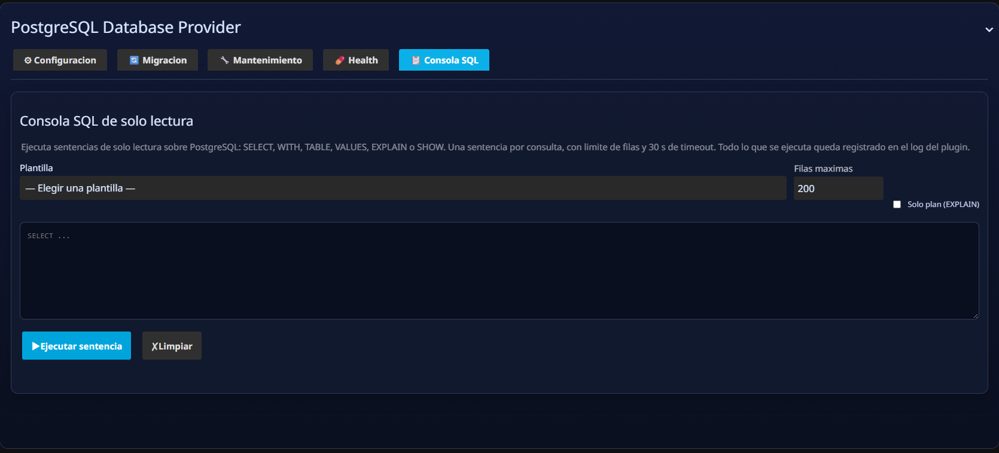

<div align="center">


🌐 &nbsp;**Español**&nbsp; · &nbsp;[**English**](README.en.md)

<br>

# 🐘 PostgreSQL Database Provider

**Plugin para Jellyfin** que reemplaza SQLite por PostgreSQL como motor de base de datos,
sin modificar el núcleo de Jellyfin. Migración bidireccional, búsqueda casi instantánea,
health check automático, mantenimiento programado e integración opcional con JellyTrend.

<br>

[](https://github.com/BORNIOS/Jellyfin-Database-Providers-Postgres/commits/main)
[](https://github.com/BORNIOS/Jellyfin-Database-Providers-Postgres/actions)
[](https://jellyfin.org)
[](https://github.com/BORNIOS/Jellyfin-Database-Providers-Postgres/releases/latest)
[](https://github.com/BORNIOS/Jellyfin-Database-Providers-Postgres/releases)
[](https://discord.jellyfin.org)
[](LICENSE)

</div>

> **v3 / Jellyfin 12.1:** requiere .NET 10 y PostgreSQL 16+. Consulta la [guía de actualización y pruebas](docs/JELLYFIN-12.1.md) antes de sustituir el proveedor.
>
> **¿Vienes de Jellyfin 10.11.x con PostgreSQL?** Sigue el [manual de migración 10.11.x → 12.x](docs/migracion-10.11-a-12.md): necesitas el plugin **2.0.1** para exportar PostgreSQL a SQLite antes de actualizar el servidor y el plugin **3.0.0** para importar de vuelta a PostgreSQL.

---

## 📚 Documentación

| Documento | Contenido |
|---|---|
| [Migración 10.11.x → 12.x](docs/migracion-10.11-a-12.md) · [EN](docs/migration-10.11-to-12.en.md) | Manual paso a paso, con diagrama y plan de contingencia |
| [Novedades de 3.0.0](docs/novedades-3.0.0.md) · [EN](docs/whats-new-3.0.0.en.md) | Qué cambia en 3.0.0 frente a 2.0.1 |
| [Adaptación a Jellyfin 12.1](docs/JELLYFIN-12.1.md) | Notas técnicas y cómo ejecutar la suite de pruebas |
| [Verificación automatizada](docs/VERIFICACION-RESUMEN.md) | Resumen ejecutivo generado desde la suite real |

---

## ✨ Características

- 🐘 **PostgreSQL como backend nativo** — EF Core + Npgsql, sin tocar el core de Jellyfin.
- 🔍 **Búsqueda casi instantánea** (< 15 ms típico) con índice GIN trigram (`pg_trgm`); fallback automático a `ILIKE`.
- 🔄 **Migración bidireccional** — SQLite → PostgreSQL y PostgreSQL → SQLite sin herramientas externas.
- 🩺 **Health Check automático** al arrancar: diagnostica bloat, índices inválidos, secuencias desfasadas y queries lentas.
- 🛡️ **Prevención de errores** — interceptores EF Core para upserts, logging de errores DB y normalización de `DateTime.Kind`.
- 🔧 **Optimización automática** — índices GIN CONCURRENTLY, tuning de autovacuum en tablas críticas.
- 💾 **Backups programados** con `pg_dump`, compresión ZIP opcional y restore desde la UI.
- ⚡ **Integración opcional con JellyTrend** — recomendaciones 4-10× más rápidas con SQL nativo optimizado.
- 📊 **Estadísticas de BD** — tamaño, conexiones activas y análisis tabla por tabla desde la UI.
- 🧪 **Consola SQL de solo lectura** — lanza consultas de diagnóstico desde el panel con 10 plantillas e historial; rechaza cualquier sentencia que modifique datos.
- 🔁 **Rollback a SQLite** en un clic desde la configuración.

---

## ⚙️ Compatibilidad

| Componente | Versión |
|---|---|
| Jellyfin | **12.1.x** — para Jellyfin 10.11.x usa el plugin **2.0.1** |
| PostgreSQL | **16 +** (recomendado 17) |
| .NET | **10.0** |

> ℹ️ El plugin implementa `IJellyfinDatabaseProvider`, el mismo contrato que usa el proveedor SQLite
> incluido en Jellyfin 12.1. No requiere modificar el núcleo de Jellyfin.

---

## 🚀 Instalación

### Opción A — repositorio de plugins (recomendada)

1. En Jellyfin entra en **Panel → Avanzado → Repositorios de complementos**.
2. Pulsa **Añadir repositorio** y usa esta URL:

   ```
   https://raw.githubusercontent.com/BORNIOS/Jellyfin-Database-Providers-Postgres/main/manifest.json
   ```

3. Guarda, ve al **Catálogo**, busca **PostgreSQL Database Provider** e **Instala**.
4. Acepta el reinicio cuando te lo pida.

### Opción B — ZIP manual

1. Descarga el ZIP del [**Release**](https://github.com/BORNIOS/Jellyfin-Database-Providers-Postgres/releases/latest).
2. Descomprímelo en la carpeta de plugins de Jellyfin.
3. Reinicia Jellyfin.

> 💡 Ubicaciones habituales de la carpeta de plugins:
> - **Linux / Docker:** `/config/plugins/`
> - **Windows:** `%LOCALAPPDATA%\jellyfin\plugins\`

---

## 🖥️ Interfaz del plugin

El plugin añade una página propia en **Panel → Complementos → PostgreSQL Database Provider** con
**cinco pestañas**, en este orden: **Configuración**, **Migración**, **Mantenimiento**, **Health** y
**Consola SQL**. Cada una agrupa una parte del ciclo de vida de la base de datos.

### ⚙️ Configuración — conexión, pool y motor activo

Es el punto de entrada: define a qué PostgreSQL te conectas, con qué parámetros de pool y qué motor
usa Jellyfin ahora mismo (SQLite o PostgreSQL).


**Estado actual** — resumen en vivo de lo que el plugin está usando de verdad: motor activo,
archivo SQLite detectado, esquema y una línea con `Pool: min-max · Timeout · Prepared statements`.

**Conexión PostgreSQL**

| Parámetro | Descripción | Default |
|---|---|---|
| Connection string | Cadena completa de Npgsql | — |
| Schema | Schema PostgreSQL a usar | `public` |
| PgBin path | Ruta a `pg_dump` / `psql` / `pg_restore` | auto-detect |
| Backup directory | Carpeta donde se guardan los backups | `<DataPath>/postgres-backups` |
| Backup compression | Comprimir el backup en ZIP | `true` |

**Opciones avanzadas**

| Parámetro | Descripción | Default |
|---|---|---|
| Min pool size | Conexiones mínimas que mantiene abiertas Npgsql | `4` |
| Max pool size | Conexiones máximas del pool | `100` |
| Max auto-prepare | Sentencias preparadas en el servidor (0 = desactivado) | `50` |
| Command timeout | Tiempo máximo de una query EF Core (segundos) | `600` |

> ℹ️ Si tu cadena de conexión ya incluye una de estas claves, **ese valor manda** y la configuración
> solo rellena lo que falte. Los cambios de pool requieren **reiniciar Jellyfin** para aplicarse.

**Acciones**

| Botón | Función |
|---|---|
| **Probar conexion** | Valida la cadena y devuelve la versión del servidor PostgreSQL |
| **Guardar configuracion** | Persiste conexión, opciones avanzadas y rutas (rechaza `max < min`) |
| **Activar PostgreSQL y reiniciar** | Escribe `config/database.xml` en modo `PLUGIN_PROVIDER` y reinicia el servidor |
| **Revertir a SQLite y reiniciar** | Elimina `config/database.xml` y vuelve a SQLite |

**Flujo recomendado:** 1) **Probar conexión** → 2) ajustar pool y timeout → 3) **Guardar
configuración** → 4) migrar los datos → 5) **Activar PostgreSQL**.

---

### 🔄 Migración

Dos operaciones disponibles con progreso en vivo:


#### SQLite → PostgreSQL

Copia `jellyfin.db` a PostgreSQL tabla por tabla.

1. La ruta de `jellyfin.db` se autodetecta (`{DataPath}/jellyfin.db`).
2. Ajusta el **batch size** (default 1000).
3. Activa **Truncar tablas antes de insertar** si repites la migración sobre datos existentes.
4. Pulsa **Iniciar migración** y sigue el progreso.
5. Al llegar al 100 %, activa PostgreSQL desde la pestaña Configuración.

> ⚠️ La opción `--truncate` hace `TRUNCATE + RESTART IDENTITY + CASCADE` en el destino. Úsala en reintentos para evitar duplicados; es destructiva con datos existentes.

#### PostgreSQL → SQLite

Exporta toda la base directamente a un archivo `.db` nativo sin herramientas externas.

- Si el `.db` no existe → lo crea con el schema derivado de PostgreSQL.
- Si el `.db` ya existe → preserva las tablas y reemplaza solo el contenido (`DELETE` + `INSERT`).
- Escritura en transacciones de 10 000 filas con `PRAGMA journal_mode=WAL`.

**Casos de uso:** revertir a SQLite, copia portable de seguridad, inspección local.

---

### 🛠️ Mantenimiento

Operaciones de mantenimiento, backups y estadísticas de la base de datos.


| Acción | Función |
|---|---|
| **VACUUM ANALYZE** | Libera espacio y actualiza estadísticas del planificador |
| **REINDEX DATABASE** | Reconstruye todos los índices |
| **Aplicar optimizaciones** | Crea 9 índices GIN CONCURRENTLY y ajusta autovacuum en las tablas críticas |
| **Crear backup ahora** | Genera un `.sql` con `pg_dump` (y `.zip` si la compresión está activa) |
| **Restablecer backup** | Restaura desde `.sql` o `.zip`, con selector de backups disponibles |
| **Actualizar estadisticas** | Tamaño total, conexiones activas y métricas tabla por tabla |

> 💡 **Aplicar optimizaciones** activa también la búsqueda casi instantánea cuando `pg_trgm` está
> disponible, y es el paso que crea los índices GIN que usa el endpoint de búsqueda.

---

### 🩺 Health — diagnóstico automático

Comprueba la salud de la base **10 segundos después del arranque** y permite relanzar el chequeo a
mano desde la propia pestaña.


| Check | Qué comprueba |
|---|---|
| **Conexión** | Que PostgreSQL responde, y con qué latencia |
| **Extensiones** | Que `pg_trgm` y `pg_stat_statements` están disponibles |
| **Índices inválidos** | Índices en estado `invalid`, con reparación en un clic |
| **Bloat de tablas** | Tablas con más de 20 % de tuplas muertas |
| **Secuencias desfasadas** | Secuencias fuera de rango respecto a los datos |
| **Estadísticas obsoletas** | Tablas sin `ANALYZE` reciente |
| **Queries lentas** | Top consultas por tiempo acumulado (vía `pg_stat_statements`) |

Cada resultado lleva semáforo `Info` / `Warn` / `Error`, y los problemas marcados como reparables se
corrigen desde la misma card. El resumen del arranque queda además en el log del plugin:

```
[HealthCheck] Resumen arranque: 0 error(es), 0 advertencia(s), 65 informativo(s) | Severidad: Ok
```

---

### 🧪 Consola SQL — consultas de solo lectura

Herramienta de diagnóstico para lanzar `SELECT` contra la base del plugin sin salir del panel ni
abrir una sesión `psql`.



- **Solo lectura por diseño**: rechaza `INSERT` / `UPDATE` / `DELETE` / DDL y también varias
  sentencias enviadas a la vez.
- **10 plantillas** listas para usar: consultas lentas, tamaño por tabla, índices sin uso,
  conexiones activas, bloat, bloqueos, y más.
- Las plantillas filtran por base de datos y excluyen sentencias administrativas, así que no
  arrastran ruido de otras bases del mismo servidor PostgreSQL.
- **Historial** de las últimas consultas conservado en la sesión del navegador, con botón para
  limpiarlo.

---

## 🔍 Búsqueda casi instantánea

Cuando los índices GIN están activos, el plugin expone un endpoint propio que evita EF Core:

- Latencia típica **< 15 ms** en bibliotecas medianas y grandes (depende del hardware y del cliente).
- Búsqueda por nombre, path y tipo de ítem.
- **Fallback automático** a `ILIKE` si los índices GIN aún no existen.
- Se activa en **Mantenimiento → Aplicar optimizaciones**.

---

## 🔁 Activar / Desactivar PostgreSQL

### Activar PostgreSQL

1. Configura y prueba la conexión en la pestaña **Configuración**.
2. Migra los datos (**Migración → SQLite → PostgreSQL**).
3. Pulsa **Activar PostgreSQL** y confirma el reinicio.

Resultado: `database.xml` se escribe en modo `PLUGIN_PROVIDER` apuntando a este plugin.

### Volver a SQLite (rollback)

1. En **Configuración** pulsa **Desactivar / Volver a SQLite**.
2. El plugin elimina `database.xml`.
3. Reinicia Jellyfin.

Cuándo hacer rollback: caída de conectividad a PostgreSQL, mantenimiento urgente o migración incompleta.

---

## 💾 Backups

### Configurar

En **Configuración**:
- **PgBin path** — ruta a `pg_dump`/`psql`/`pg_restore`. Déjalo vacío para usar el PATH del sistema.
- **Backup directory** — carpeta destino de los archivos.
- **Backup compression** — activa ZIP del `.sql`.

### Manual

En **Mantenimiento**: **Crear backup ahora** / **Restablecer backup** (acepta `.sql` o `.zip`).

---

## 📅 Tareas programadas

| Tarea | Default | Descripción |
|---|---|---|
| **PostgreSQL Backup** | Diario 02:00 | Backup con `pg_dump` |
| **PostgreSQL VACUUM ANALYZE** | Domingo 03:00 | Libera espacio y actualiza estadísticas |
| **PostgreSQL REINDEX DATABASE** | Domingo 04:00 | Reconstruye todos los índices |
| **Optimize GIN Indexes** | Domingo 05:00 | Mantiene los índices GIN trigram frescos |

> ⚠️ Evita solapar REINDEX, VACUUM y Backup en la misma ventana horaria.

---

## ⚡ Integración con JellyTrend

Si tienes instalado [**JellyTrend**](https://github.com/BORNIOS/JellyTrend), el motor de recomendaciones detecta automáticamente este plugin y sustituye las queries de `ILibraryManager` por SQL nativo optimizado:

| Motor | Comportamiento |
|---|---|
| **SQLite** (sin este plugin) | `ILibraryManager` — compatible con cualquier instalación |
| **PostgreSQL** (con este plugin) | SQL directo con operador `&&` de arrays + índices GIN — **4-10× más rápido** |

> ✅ Sin configuración manual. Si ambos plugins están instalados, la integración se activa sola.

---

## ✅ Checklist post-migración

1. Login correcto con los usuarios existentes.
2. Progreso de reproducción actualizando correctamente.
3. Conteos clave validados (UserData, Users, BaseItems).
4. Sin errores de conexión PostgreSQL en logs de Jellyfin.
5. Health Check ejecutado sin errores (`Warn` aceptable, `Error` requiere acción).
6. Backup manual probado al menos una vez.
7. Índices GIN aplicados (**Mantenimiento → Aplicar optimizaciones**).

---

## ❓ FAQ

<details>
<summary><b>Instalé el plugin pero no migró datos automáticamente.</b></summary>

Es el comportamiento esperado. Ejecuta la migración desde **Migración → SQLite → PostgreSQL** y luego activa PostgreSQL desde **Configuración**.
</details>

<details>
<summary><b>La migración falla o da resultados raros en reintentos.</b></summary>

Activa **Truncar tablas antes de insertar** para reiniciar las tablas destino antes de insertar. Es destructivo sobre datos existentes en PostgreSQL, pero garantiza un resultado limpio.
</details>

<details>
<summary><b>¿Puedo editar database.xml manualmente?</b></summary>

Sí, pero se recomienda usar la UI del plugin para evitar errores de formato.
</details>

<details>
<summary><b>¿Qué pasa si exporto a SQLite y el .db ya existe?</b></summary>

El plugin preserva la estructura de tablas y reemplaza solo los datos (DELETE + INSERT). El archivo no se elimina ni recrea.
</details>

<details>
<summary><b>¿La búsqueda rápida requiere cambios en el cliente Jellyfin?</b></summary>

No. Es un endpoint de servidor. La UI del plugin lo usa internamente cuando PostgreSQL está activo y los índices GIN existen.
</details>

<details>
<summary><b>¿Por qué los timestamps muestran UTC en lugar de mi zona horaria?</b></summary>

En versiones anteriores se usaba el switch global `Npgsql.EnableLegacyTimestampBehavior` que forzaba UTC en todas las lecturas. Desde v2.0.0.0 esto se reemplazó por el interceptor `DateTimeKindNormalizingInterceptor`, que solo normaliza parámetros de escritura con `Kind=Unspecified`, respetando la timezone del servidor PostgreSQL en las lecturas.
</details>

---

## 🤝 Comunidad

¿Dudas, sugerencias o encontraste un bug? Abre un [issue](https://github.com/BORNIOS/Jellyfin-Database-Providers-Postgres/issues) o únete a la comunidad oficial de Jellyfin:

[](https://discord.jellyfin.org)
[](https://www.reddit.com/r/jellyfin)

---

<div align="center">

Hecho con ❤️ para la comunidad Jellyfin &nbsp;·&nbsp; [⭐ Star en GitHub](https://github.com/BORNIOS/Jellyfin-Database-Providers-Postgres)

</div>
