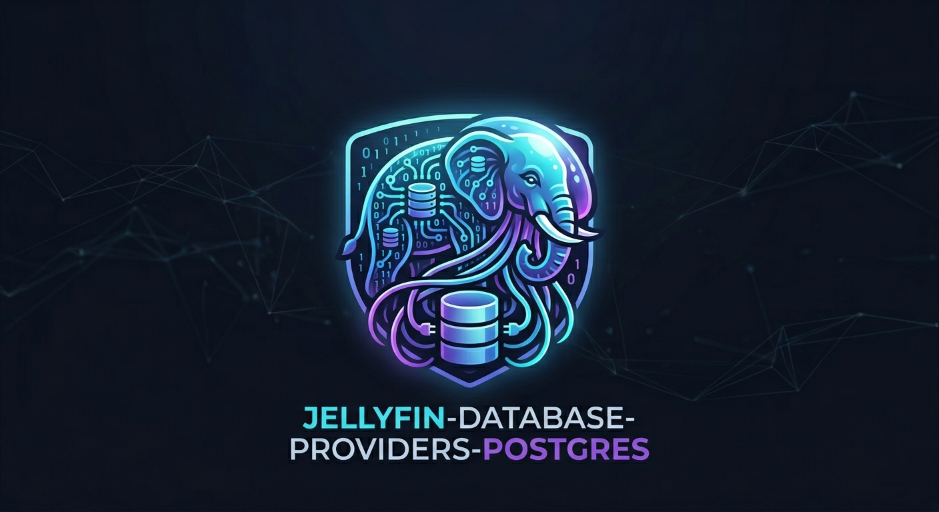

# Solucion PostgreSQL para Jellyfin



Solucion lista para produccion para usar PostgreSQL como backend de Jellyfin por medio de PLUGIN_PROVIDER.

[](https://jellyfin.org)
[](https://github.com/BORNIOS/Jellyfin-Database-Providers-Postgres/releases/latest)

Idioma: [Español](README.md) | [English](README.en.md)

---

## Resumen Ejecutivo

Este repositorio no es una prueba de concepto. Es una solucion de infraestructura para ejecutar Jellyfin con PostgreSQL sin tocar el core del servidor.

Objetivos de la solucion:

- Reemplazar SQLite por PostgreSQL en Jellyfin.
- Mantener compatibilidad con el modelo de plugins oficial.
- Instalar y actualizar mediante manifest de repositorio.

## Valor Operativo

- Mejor comportamiento en bibliotecas grandes y con concurrencia.
- Respaldo y restablecimiento desde el panel del plugin usando pg_dump/psql.
- Despliegue consistente por manifest + release assets.

## Compatibilidad

| Componente | Version |
| --- | --- |
| Jellyfin | 10.11.10 |
| Runtime .NET host | 9.0.x |
| EF Core | 9.0.x |
| Npgsql EF provider | 9.0.4 |
| PostgreSQL | 13+ (recomendado 16/17) |

## Instalacion desde MANIFEST (recomendado)

Esta es la ruta oficial de instalacion.

1. En Jellyfin, abrir Admin.
1. Ir a Plugins -> Plugin Repositories.
1. Agregar un repositorio con esta URL:

```text
https://raw.githubusercontent.com/BORNIOS/Jellyfin-Database-Providers-Postgres/main/manifest.json
```

1. Guardar, refrescar catalogo e instalar PostgreSQL Database Provider.

## Instalacion manual por ZIP

1. Descargar el ZIP de la ultima release.
1. Extraer en la carpeta de plugins de Jellyfin.
1. Reiniciar Jellyfin.
1. Configurar el plugin desde el dashboard.

## Ejemplo manual de database.xml

```xml
<DatabaseConfigurationOptions xmlns:xsi="http://www.w3.org/2001/XMLSchema-instance" xmlns:xsd="http://www.w3.org/2001/XMLSchema">
  <DatabaseType>PLUGIN_PROVIDER</DatabaseType>
  <LockingBehavior>NoLock</LockingBehavior>
  <CustomProviderOptions>
    <PluginName>Jellyfin.Database.Providers.Postgres</PluginName>
    <PluginAssembly>Jellyfin.Database.Providers.Postgres.dll</PluginAssembly>
    <ConnectionString>Host=127.0.0.1;Port=5432;Database=jellyfin;Username=jellyfin;Password=CHANGE_ME;Pooling=true;Maximum Pool Size=200</ConnectionString>
    <Options>
      <CustomDatabaseOption>
        <Key>command-timeout</Key>
        <Value>60</Value>
      </CustomDatabaseOption>
      <CustomDatabaseOption>
        <Key>EnableSensitiveDataLogging</Key>
        <Value>False</Value>
      </CustomDatabaseOption>
    </Options>
  </CustomProviderOptions>
</DatabaseConfigurationOptions>
```

## Modelo de Release

- Fuente unica de verdad para clientes Jellyfin: manifest.json.
- CI compila ZIP, regenera manifest con checksum y sourceUrl versionado, y publica ambos como assets del release.

## Notas de Operacion

- La migracion desde SQLite no es automatica.
- Usar Jellyfin.SqliteToPostgres.Migrator antes del cambio.
- El plugin permite crear backups y restablecer archivos .sql/.zip desde Mantenimiento.
- Tambien puedes programar backups periodicos desde Tareas programadas de Jellyfin.

## Backup y Restore en el plugin

1. Ir a la pestana Configuracion y guardar primero:
1. Directorio de backup por defecto.
1. Ruta de pg_dump (opcional, recomendada en Windows cuando no esta en PATH).
1. Ruta de psql (opcional, recomendada en Windows cuando no esta en PATH).
1. Comportamiento de compresion por defecto (ZIP).
1. Guardar configuracion.
1. Ir a Mantenimiento para ejecutar respaldo manual o restablecer un backup `.sql` / `.zip`.

Notas:
- Configuracion concentra las rutas (pg_dump/psql) y directorio por defecto.
- Mantenimiento solo ejecuta tareas, sin duplicar campos de rutas.
- Las tareas programadas usan la configuracion persistida (incluyendo rutas de binarios).
- Si dejas rutas vacias, el plugin intentara resolver `pg_dump` y `psql` desde PATH del sistema.
