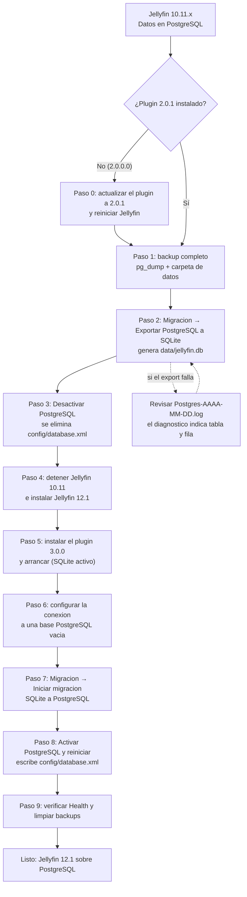

# Migración de Jellyfin 10.11.x a Jellyfin 12.x con PostgreSQL

Guía oficial para pasar de **Jellyfin 10.11.x + PostgreSQL Database Provider 2.0.1** a
**Jellyfin 12.1.x + PostgreSQL Database Provider 3.0.0** sin perder biblioteca,
usuarios ni datos de reproducción.

> Versión en inglés: [`migration-10.11-to-12.en.md`](migration-10.11-to-12.en.md)

---

## 1. Resumen en una tabla

| Servidor | Plugin | Framework | `targetAbi` | Archivo de base de datos SQLite |
|---|---|---|---|---|
| Jellyfin 10.11.x | **2.0.1** (net9.0) | .NET 9 | `10.11.0.0` | `jellyfin.db` (export del plugin) |
| Jellyfin 12.1.x | **3.0.0** (net10.0) | .NET 10 | `12.1.0.0` | `jellyfin.db` (base viva) + `library.db` (rutinas heredadas) |

Ruta soportada, en una línea:

```
10.11.11 + plugin 2.0.1 → exportar PostgreSQL a SQLite → actualizar el servidor a 12.1
                        → instalar plugin 3.0.0 → importar SQLite a PostgreSQL
```

El **plugin 3.0.0 no puede leer PostgreSQL creado por la versión 2.x**: la versión 3.0.0
trabaja contra el modelo de datos y el contrato de proveedores de Jellyfin 12.1. Por eso
el puente entre ambas versiones es un archivo SQLite exportado por el plugin 2.0.1.

---

## 2. Por qué el plugin 2.0.1 es imprescindible

El proceso de ida y vuelta (PostgreSQL → SQLite → PostgreSQL) depende del **export**
que vive en la pestaña *Migracion* del plugin. Ese export tenía un defecto en 2.0.0.0
que la versión **2.0.1** corrige:

- En PostgreSQL existen pares de filas que solo difieren **en el uso de mayúsculas** de
  una columna que forma parte de la clave primaria (por ejemplo `UserData.ItemId`
  con `ae19…` y `AE19…`).
- Al exportar, esos valores se normalizaban, ambas filas colapsaban en la misma clave y
  el export **abortaba** con un error de SQLite del tipo:

  ```
  SQLite Error 19: UNIQUE constraint failed: UserData.ItemId, UserData.UserId, UserData.CustomDataKey
  ```

- El arreglo (`f91432d`, rama `release/2.0.1`) copia **verbatim** las columnas que forman
  la clave primaria y añade un **diagnóstico** que indica tabla, número de fila y valores
  de la clave cuando existe una violación de constraint.

Consecuencia práctica: **quien llegue a Jellyfin 12 sin haber podido exportar desde
10.11 no tiene ruta limpia para llevar sus datos**. Por eso 2.0.1 se publica **antes**
que 3.0.0: sin export no hay puente entre ambos servidores.

---

## 3. Diagrama del proceso



---

## 4. Paso a paso

### Paso 0 — Actualizar el plugin a 2.0.1 (solo si vienes de 2.0.0.0)

1. En el panel de Jellyfin 10.11: **Panel → Complementos → Catálogo → PostgreSQL Database Provider**.
2. Instala la versión **2.0.1** y reinicia Jellyfin.
3. Verifica en **Panel → Registros** que el arranque termina sin errores de base de datos.

> No actualices el servidor a 12.x antes de este paso: una vez en 12.1 el plugin 2.0.1
> ya no arranca (está compilado para .NET 9 sobre el contrato de 10.11).

### Paso 1 — Backup completo

```bash
# 1.a Volcado de PostgreSQL (ajusta host/usuario/base)
pg_dump --format=custom --file=jellyfin-pre-12.dump "postgresql://Jellyfin@127.0.0.1:5432/Jellyfin"

# 1.b Copia de la carpeta de datos completa (incluye config, metadata y plugins)
#     Windows: %LOCALAPPDATA%\jellyfin        Linux: /var/lib/jellyfin
```

El plugin también puede generarlo desde **Mantenimiento → Crear backup ahora**.

### Paso 2 — Exportar PostgreSQL a SQLite

En el plugin 2.0.1, pestaña **Migracion** → sección **Exportar PostgreSQL → SQLite**:

1. **Ruta del archivo .db destino** — déjala vacía para usar el valor autodetectado:
   `<DataPath>/jellyfin.db` (por ejemplo `%LOCALAPPDATA%\jellyfin\data\jellyfin.db`).
2. Pulsa **Iniciar exportacion a SQLite** y sigue el progreso (tabla actual y filas escritas).
3. Al terminar verás `Export completado: <ruta>` y, en el log del plugin, el número de
   filas y el tamaño final.

Durante el export el plugin además:

- Escribe el esquema SQLite derivado de PostgreSQL y sólo copia las columnas presentes
  en ambos motores, para conservar intactas las claves foráneas.
- Crea un `library.db` **mínimo pero válido** (4096 bytes) junto al archivo exportado.
  Es necesario porque las rutinas de migración heredadas de Jellyfin 12.1
  (`Jellyfin.Server/Migrations/Routines/*MigrateLibraryDb*.cs`) leen `library.db` y lo
  respaldan antes de ejecutarse; si el archivo no existe o está corrupto, el respaldo
  falla y **el arranque se aborta**.
- Copia el historial de migraciones de código realmente aplicadas y elimina filas
  huérfanas que apuntan a usuarios inexistentes, para evitar fallos de FK al volver a SQLite.

> ⚠️ No muevas ni borres `library.db` después del export: Jellyfin 12.1 lo necesita como
> archivo válido, aunque no contenga datos de tu biblioteca.

### Paso 3 — Desactivar PostgreSQL

En la pestaña **Configuracion**, pulsa **Desactivar / Volver a SQLite** (el texto del
botón es *Revertir a SQLite y reiniciar*). El plugin elimina `<config>/database.xml`, de
modo que la próxima vez **Jellyfin arranca en SQLite**.

Comprueba, justo después de pulsar el botón, que el archivo ya no está:

```powershell
Test-Path "$env:LOCALAPPDATA\jellyfin\config\database.xml"   # debe devolver False
```

> ℹ️ Al arrancar, Jellyfin **vuelve a crear** `config/database.xml` declarando SQLite. Es
> normal y es la confirmación de que el motor activo es el correcto:
>
> ```xml
> <?xml version="1.0" encoding="utf-8"?>
> <DatabaseConfigurationOptions xmlns:xsi="http://www.w3.org/2001/XMLSchema-instance" xmlns:xsd="http://www.w3.org/2001/XMLSchema">
>   <DatabaseType>Jellyfin-SQLite</DatabaseType>
>   <LockingBehavior>NoLock</LockingBehavior>
> </DatabaseConfigurationOptions>
> ```

Lo que **no** debe aparecer en ese archivo es `PLUGIN_PROVIDER`:

```powershell
Select-String -Path "$env:LOCALAPPDATA\jellyfin\config\database.xml" -Pattern 'PLUGIN_PROVIDER'   # sin resultados
```

### Paso 4 — Instalar Jellyfin 12.1

1. Detén Jellyfin 10.11 por completo.
2. Instala Jellyfin **12.1.x** (requiere .NET 10) **manteniendo la misma carpeta de datos**.
3. Arranca una vez: Jellyfin 12.1 abrirá `jellyfin.db` (los datos que exportaste) y
   ejecutará sus rutinas heredadas contra `library.db`.

Si el servidor no arranca, revisa el log del servidor (`log/log_AAAAMMDD.log`) y el log
del plugin (`log/Postgres-AAAA-MM-DD.log`).

### Paso 5 — Instalar el plugin 3.0.0

Tienes dos caminos; el primero es el más cómodo:

**Opción A — desde el catálogo (recomendada)**

1. En Jellyfin 12.1 abre **Panel → Complementos → Catálogo**.
2. Busca **PostgreSQL Database Provider** e instala la versión **3.0.0.0**.
3. Acepta el reinicio que propone Jellyfin.

**Opción B — instalación manual**

1. Descarga el ZIP `Jellyfin.Database.Providers.Postgres-3.0.0.0.zip` del release **v3.0.0**.
2. Crea la carpeta `<DataPath>/plugins/PostgreSQL Database Provider_3.0.0.0/` y descomprime
   dentro sus tres DLL: `Jellyfin.Database.Providers.Postgres.dll`, `Npgsql.dll` y
   `Npgsql.EntityFrameworkCore.PostgreSQL.dll`.
3. Reinicia Jellyfin.

En cualquiera de los dos casos, confirma en **Panel → Complementos** que aparece la versión
3.0.0.0 y que el log del plugin muestra el modo activo:

   ```
   [ENGINE] Modo activo: SQLite. Archivo: ...\data\jellyfin.db (NNN,N MB)
   ```

### Paso 6 — Configurar la conexión

En la pestaña **Configuracion** del plugin, escribe la cadena de conexión y elige una de
estas dos variantes:

| Opción | Cuándo usarla | Qué tener en cuenta |
|---|---|---|
| **A. Base nueva y vacía** | Quieres partir de cero y comparar el resultado contra el backup | Crea antes la base y su usuario; el plugin no crea bases |
| **B. Reutilizar la base de 10.11.x** | Ya tenías PostgreSQL y no quieres mover nada | Funciona igual: activa **Truncar tablas antes de insertar** en el Paso 7 para que el import reemplace el contenido en lugar de chocar con las claves primarias existentes |

Reutilizar la base original es totalmente válido —es la ruta que se usó en las pruebas de
este manual— y sólo conviene revisar los residuos de pruebas anteriores:

- bases temporales de comprobación (`jellyfin_provider_test_*`) que hayan quedado atrás;
- ruido en `pg_stat_statements` si antes se ejecutaron diagnósticos: se limpia con
  `SELECT pg_stat_statements_reset();`.

1. Pulsa **Probar conexion**. Debe responder `OK`.
2. Opcional: ajusta **Opciones avanzadas** (tamaño mínimo/máximo del pool, sentencias
   preparadas, tiempo de espera) y pulsa **Guardar configuracion**. Los valores se reflejan
   en **Current status** y los aplica el proveedor al activar PostgreSQL.

### Paso 7 — Importar SQLite a PostgreSQL

1. Pestaña **Migracion**, sección **Migrar datos de SQLite a PostgreSQL**.
2. Verifica la ruta de `jellyfin.db` (se autodetecta).
3. Con una base nueva, deja **Truncar tablas antes de insertar** desactivado; si reutilizas
   la base de 10.11.x (opción B del Paso 6), **actívalo** para reemplazar el contenido
   existente en lugar de duplicarlo.
4. Pulsa **Iniciar migracion** y espera al 100 %.
5. Al terminar, el panel habilita **Activar PostgreSQL y reiniciar Jellyfin**.

### Paso 8 — Activar PostgreSQL

1. Pulsa **Activar PostgreSQL y reiniciar Jellyfin** y confirma el reinicio.
2. El plugin escribe `<config>/database.xml` apuntando a este proveedor y Jellyfin reinicia
   sobre PostgreSQL.
3. Confirma en el log del plugin:

   ```
   [ENGINE] Modo activo: PostgreSQL. Connection: Host=...;Password=*****
   ```

### Paso 9 — Verificar

1. **Health**: el semáforo debe quedar en `Ok` (conexión, índices inválidos, bloat,
   secuencias y consultas lentas).
2. **Mantenimiento → Actualizar estadisticas**: tamaño total y métricas por tabla.
3. **Mantenimiento → Aplicar optimizaciones**: crea los índices GIN y activa la búsqueda
   casi instantánea.
4. Navega por la biblioteca y reproduce algo: la prueba definitiva es que el conteo de
   ítems y los datos de reproducción coincidan con el backup del Paso 1.

---

## 5. Dónde vive cada archivo (referencia)

| Elemento | Ruta |
|---|---|
| Base SQLite viva en Jellyfin 12.1 | `<DataPath>/jellyfin.db` |
| Archivo heredado que leen las rutinas de 12.1 | `<DataPath>/library.db` |
| Selector de motor | `<config>/database.xml` (existe = PostgreSQL) |
| Log del plugin | `<log>/Postgres-AAAA-MM-DD.log` |
| Backups del plugin | `<DataPath>/postgres-backups` |
| Backups de migración | `<DataPath>/postgres-migration-backups` |

`<DataPath>` es la carpeta `data` de Jellyfin (`%LOCALAPPDATA%\jellyfin\data` en Windows,
`/var/lib/jellyfin/data` en Linux) y `<config>` la carpeta `config`.

---

## 6. Si algo falla

| Síntoma | Causa más probable | Acción |
|---|---|---|
| El export aborta con `UNIQUE constraint failed` | Vienes de 2.0.0.0 | Paso 0: instala 2.0.1 y repite |
| El export termina pero faltan tablas | La tabla no existe en el `.db` destino | Usa una ruta nueva (el plugin crea el esquema) o revisa el log |
| Jellyfin 12.1 no arranca y el log habla de `library.db` | El archivo heredado falta o está corrupto | Restaura el `library.db` que creó el export (4096 bytes válidos) |
| El plugin 3.0.0 no aparece | Carpeta/versión incorrecta | Comprueba `<DataPath>/plugins/PostgreSQL Database Provider_3.0.0.0/` |
| La importación falla con `FK` | Datos huérfanos en el `.db` origen | Repite con **Truncar tablas antes de insertar** |

**Rollback:** detén Jellyfin, restaura el volcado del Paso 1 y elimina
`<config>/database.xml`. Jellyfin volverá a SQLite con el `jellyfin.db` exportado.

---

## 7. Ruta alternativa: seguir en PostgreSQL sin pasar por SQLite

Es posible **no exportar a SQLite** y apuntar directamente el plugin 3.0.0 a la misma base
PostgreSQL que usaba 10.11, porque el esquema es el mismo modelo EF y Jellyfin 12.1 trae
sus propias migraciones. Riesgos a tener en cuenta:

- El plugin 3.0.0 aplicará las migraciones del modelo de 12.1 sobre una base creada por
  el modelo de 10.11; cualquier deriva de esquema previa se propaga.
- No existe un archivo SQLite que sirva de red de seguridad.
- Si algo sale mal, sólo puedes volver por el volcado de PostgreSQL del Paso 1.

Recomendación: **usa la ruta del export** (secciones 4 de este documento) si quieres una
migración reproducible y con vuelta atrás verificable; reserva esta ruta para instalaciones
donde el export sea inviable y tengas un backup reciente probado.

---

## 8. Preguntas frecuentes

**¿Puedo saltarme el plugin 2.0.1 si voy directo a Jellyfin 12?**
Sí, sólo con la ruta alternativa de la sección 7 y asumiendo sus riesgos. La ruta
soportada exige exportar desde 2.0.1 **antes** de subir el servidor.

**¿Necesito el mismo hardware o ruta de datos?**
No, pero es lo más simple. Si cambias de máquina, copia la carpeta de datos completa: el
`jellyfin.db` exportado es portátil.

**¿Y si mi base 2.x tenía esquema personalizado o plugins de terceros?**
Los datos se exportan tabla por tabla; los objetos exclusivos de PostgreSQL (vistas,
funciones propias) no forman parte de la migración. Revisa el log del export para ver la
lista de tablas copiadas.

**¿Cuánto tarda?**
Con una biblioteca mediana (decenas de miles de ítems) el export y la importación suelen
terminar en pocos minutos; el cuello de botella es el disco, no la CPU.

---

## 9. Sigue leyendo

- [Novedades de 3.0.0 frente a 2.0.1](novedades-3.0.0.md)
- [Guía técnica de la adaptación a Jellyfin 12.1](JELLYFIN-12.1.md)
- [Resumen de verificación automatizada](VERIFICACION-RESUMEN.md)
