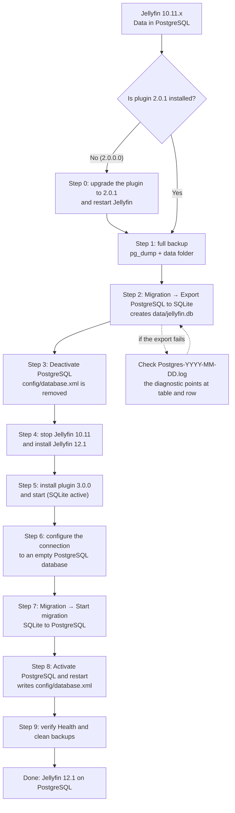

# Migrating from Jellyfin 10.11.x to Jellyfin 12.x with PostgreSQL

Official guide to move from **Jellyfin 10.11.x + PostgreSQL Database Provider 2.0.1** to
**Jellyfin 12.1.x + PostgreSQL Database Provider 3.0.0** without losing your library,
users or playback data.

> Spanish version (primary): [`migracion-10.11-a-12.md`](migracion-10.11-a-12.md)

---

## 1. Summary

| Server | Plugin | Framework | `targetAbi` | SQLite file |
|---|---|---|---|---|
| Jellyfin 10.11.x | **2.0.1** (net9.0) | .NET 9 | `10.11.0.0` | `jellyfin.db` (plugin export) |
| Jellyfin 12.1.x | **3.0.0** (net10.0) | .NET 10 | `12.1.0.0` | `jellyfin.db` (live DB) + `library.db` (legacy routines) |

The supported path in one line:

```
10.11.11 + plugin 2.0.1 → export PostgreSQL to SQLite → upgrade the server to 12.1
                        → install plugin 3.0.0 → import SQLite into PostgreSQL
```

**Plugin 3.0.0 cannot read a PostgreSQL database created by the 2.x line**: it targets the
Jellyfin 12.1 data model and provider contract. The bridge between both versions is a
SQLite file exported by plugin 2.0.1.

---

## 2. Why plugin 2.0.1 is mandatory

The round trip (PostgreSQL → SQLite → PostgreSQL) depends on the **export** feature in the
plugin's *Migration* tab. That export had a defect in 2.0.0.0 that **2.0.1** fixes:

- PostgreSQL can hold row pairs that differ only **by letter case** in a primary-key
  column (for example `UserData.ItemId` as `ae19…` and `AE19…`).
- During export those values were normalised, both rows collapsed into the same key and the
  export **aborted** with:

  ```
  SQLite Error 19: UNIQUE constraint failed: UserData.ItemId, UserData.UserId, UserData.CustomDataKey
  ```

- The fix (`f91432d`, branch `release/2.0.1`) copies primary-key columns **verbatim** and
  adds a **diagnostic** reporting table, row number and key values on constraint violations.

Practical consequence: **anyone reaching Jellyfin 12 without a successful export from 10.11
has no clean route for their data**. That is why 2.0.1 ships **before** 3.0.0: without an
export there is no bridge between both servers.

---

## 3. Process diagram



---

## 4. Step by step

### Step 0 — Upgrade the plugin to 2.0.1 (only if you come from 2.0.0.0)

1. In Jellyfin 10.11: **Dashboard → Plugins → Catalog → PostgreSQL Database Provider**.
2. Install **2.0.1** and restart Jellyfin.
3. Confirm in **Dashboard → Logs** that startup finishes with no database errors.

> Do not upgrade the server to 12.x first: on 12.1 plugin 2.0.1 will no longer start
> (it is built for .NET 9 against the 10.11 contract).

### Step 1 — Full backup

```bash
# 1.a PostgreSQL dump (adjust host/user/database)
pg_dump --format=custom --file=jellyfin-pre-12.dump "postgresql://Jellyfin@127.0.0.1:5432/Jellyfin"

# 1.b Copy the whole data folder (config, metadata and plugins included)
#     Windows: %LOCALAPPDATA%\jellyfin        Linux: /var/lib/jellyfin
```

The plugin can also produce it from **Maintenance → Create backup now**.

### Step 2 — Export PostgreSQL to SQLite

In plugin 2.0.1, **Migration** tab → **Export PostgreSQL → SQLite**:

1. **Target .db file path** — leave it empty to use the auto-detected default:
   `<DataPath>/jellyfin.db` (for example `%LOCALAPPDATA%\jellyfin\data\jellyfin.db`).
2. Press **Start export to SQLite** and follow progress (current table, exported rows).
3. When it finishes you get `Export completed: <path>` plus row count and final size in the
   plugin log.

During export the plugin also:

- Writes the SQLite schema derived from PostgreSQL and copies only columns present in both
  engines, so foreign keys stay intact.
- Creates a **minimal but valid** `library.db` (4096 bytes) next to the exported file.
  Jellyfin 12.1 legacy migration routines
  (`Jellyfin.Server/Migrations/Routines/*MigrateLibraryDb*.cs`) read and back up
  `library.db` before running; if it is missing or corrupt the backup fails and **startup
  aborts**.
- Copies the code-migration history that actually ran and removes orphaned rows pointing to
  non-existent users, preventing FK failures when switching back to SQLite.

> ⚠️ Do not move or delete `library.db` after the export: Jellyfin 12.1 needs it as a valid
> file even though it holds none of your library data.

### Step 3 — Deactivate PostgreSQL

In the **Configuration** tab press **Deactivate / Revert to SQLite** (*Revert to SQLite and
restart*). The plugin removes `<config>/database.xml`, so **Jellyfin starts in SQLite** next
time.

Check right after pressing the button that the file is gone:

```powershell
Test-Path "$env:LOCALAPPDATA\jellyfin\config\database.xml"   # must be False
```

> ℹ️ On startup Jellyfin **recreates** `config/database.xml` declaring SQLite. That is normal
> and it is the confirmation that the active engine is the right one:
>
> ```xml
> <?xml version="1.0" encoding="utf-8"?>
> <DatabaseConfigurationOptions xmlns:xsi="http://www.w3.org/2001/XMLSchema-instance" xmlns:xsd="http://www.w3.org/2001/XMLSchema">
>   <DatabaseType>Jellyfin-SQLite</DatabaseType>
>   <LockingBehavior>NoLock</LockingBehavior>
> </DatabaseConfigurationOptions>
> ```

What must **not** appear in that file is `PLUGIN_PROVIDER`:

```powershell
Select-String -Path "$env:LOCALAPPDATA\jellyfin\config\database.xml" -Pattern 'PLUGIN_PROVIDER'   # no output
```

### Step 4 — Install Jellyfin 12.1

1. Stop Jellyfin 10.11 completely.
2. Install Jellyfin **12.1.x** (requires .NET 10) **keeping the same data folder**.
3. Start it once: Jellyfin 12.1 opens `jellyfin.db` (your exported data) and runs its legacy
   routines against `library.db`.

If the server does not start, check the server log (`log/log_YYYYMMDD.log`) and the plugin
log (`log/Postgres-YYYY-MM-DD.log`).

### Step 5 — Install plugin 3.0.0

Two ways to do it; the first one is the smoothest:

**Option A — from the catalog (recommended)**

1. In Jellyfin 12.1 open **Dashboard → Plugins → Catalog**.
2. Find **PostgreSQL Database Provider** and install version **3.0.0.0**.
3. Accept the restart Jellyfin offers.

**Option B — manual install**

1. Download `Jellyfin.Database.Providers.Postgres-3.0.0.0.zip` from release **v3.0.0**.
2. Create `<DataPath>/plugins/PostgreSQL Database Provider_3.0.0.0/` and unzip its three
   DLLs there: `Jellyfin.Database.Providers.Postgres.dll`, `Npgsql.dll` and
   `Npgsql.EntityFrameworkCore.PostgreSQL.dll`.
3. Restart Jellyfin.

Either way, confirm in **Dashboard → Plugins** that version 3.0.0.0 is listed and the plugin
log reports the active engine:

   ```
   [ENGINE] Modo activo: SQLite. Archivo: ...\data\jellyfin.db (NNN.N MB)
   ```

### Step 6 — Configure the connection

In the plugin's **Configuration** tab, enter the connection string and pick one of these two
variants:

| Option | When to use it | What to watch out for |
|---|---|---|
| **A. New, empty database** | You want a clean slate and to compare the result against your backup | Create the database and its role first; the plugin does not create databases |
| **B. Reuse the 10.11.x database** | You already had PostgreSQL and do not want to move anything | It works: enable **Truncate tables before insert** in Step 7 so the import replaces the existing content instead of colliding with existing primary keys |

Reusing the original database is perfectly valid —it is the route used in this manual's tests—
and you only need to review leftovers from earlier tests:

- temporary check databases (`jellyfin_provider_test_*`) left behind;
- `pg_stat_statements` noise after running diagnostics: clear it with
  `SELECT pg_stat_statements_reset();`.

1. Press **Test connection**; it must answer `OK`.
2. Optional: tune **Advanced options** (minimum/maximum pool size, prepared statements,
   command timeout) and press **Save configuration**. Values are reflected in
   **Current status** and the provider applies them when PostgreSQL is activated.

### Step 7 — Import SQLite into PostgreSQL

1. **Migration** tab → **Migrate data from SQLite to PostgreSQL**.
2. Check the `jellyfin.db` path (auto-detected).
3. With a new database leave **Truncate tables before insert** off; when reusing the 10.11.x
   database (option B in Step 6) **enable it** so the existing content is replaced instead of
   duplicated.
4. Press **Start migration** and wait for 100 %.
5. When done, the panel enables **Activate PostgreSQL and restart Jellyfin**.

### Step 8 — Activate PostgreSQL

1. Press **Activate PostgreSQL and restart Jellyfin** and confirm the restart.
2. The plugin writes `<config>/database.xml` pointing at this provider and Jellyfin restarts
   on PostgreSQL.
3. Confirm in the plugin log:

   ```
   [ENGINE] Modo activo: PostgreSQL. Connection: Host=...;Password=*****
   ```

### Step 9 — Verify

1. **Health**: the traffic light must read `Ok` (connection, invalid indexes, bloat, sequences,
   slow queries).
2. **Maintenance → Refresh statistics**: total size and per-table metrics.
3. **Maintenance → Apply optimizations**: creates the GIN indexes and enables near-instant
   search.
4. Browse the library and play something: item counts and playback data must match the backup
   from Step 1.

---

## 5. Where files live (reference)

| Item | Path |
|---|---|
| Live SQLite database on Jellyfin 12.1 | `<DataPath>/jellyfin.db` |
| Legacy file read by 12.1 routines | `<DataPath>/library.db` |
| Engine selector | `<config>/database.xml` (present = PostgreSQL) |
| Plugin log | `<log>/Postgres-YYYY-MM-DD.log` |
| Plugin backups | `<DataPath>/postgres-backups` |
| Migration backups | `<DataPath>/postgres-migration-backups` |

`<DataPath>` is Jellyfin's `data` folder (`%LOCALAPPDATA%\jellyfin\data` on Windows,
`/var/lib/jellyfin/data` on Linux) and `<config>` is the `config` folder.

---

## 6. When something goes wrong

| Symptom | Most likely cause | Action |
|---|---|---|
| Export aborts with `UNIQUE constraint failed` | You are on 2.0.0.0 | Step 0: install 2.0.1 and retry |
| Export succeeds but tables are missing | Table absent from the target `.db` | Use a new path (the plugin creates the schema) or check the log |
| Jellyfin 12.1 will not start, log mentions `library.db` | Legacy file missing or corrupt | Restore the `library.db` produced by the export (4096 valid bytes) |
| Plugin 3.0.0 is not listed | Wrong folder/version | Check `<DataPath>/plugins/PostgreSQL Database Provider_3.0.0.0/` |
| Import fails with `FK` | Orphaned rows in the source `.db` | Retry with **Truncate tables before insert** |

**Rollback:** stop Jellyfin, restore the Step 1 dump and delete `<config>/database.xml`.
Jellyfin goes back to SQLite with the exported `jellyfin.db`.

---

## 7. Alternative path: staying on PostgreSQL without SQLite

You can skip the SQLite export and point plugin 3.0.0 at the same PostgreSQL database 10.11
used, because the schema is the same EF model and Jellyfin 12.1 ships its own migrations.
Risks:

- Plugin 3.0.0 will apply the 12.1 model migrations over a database created by the 10.11
  model; any previous schema drift propagates.
- There is no SQLite file acting as a safety net.
- If anything breaks, the only way back is the PostgreSQL dump from Step 1.

Recommendation: **use the export path** (section 4) for a reproducible migration with a
verifiable rollback; keep this path for installations where the export is not viable and you
hold a recent, tested backup.

---

## 8. FAQ

**Can I skip plugin 2.0.1 by going straight to Jellyfin 12?**
Only through the alternative path in section 7, accepting its risks. The supported path
requires exporting from 2.0.1 **before** upgrading the server.

**Do I need the same hardware or data path?**
No, but it is simpler. When moving machines, copy the whole data folder: the exported
`jellyfin.db` is portable.

**What about custom schemas or third-party plugins?**
Data is exported table by table; PostgreSQL-only objects (views, custom functions) are not
part of the migration. Check the export log for the list of copied tables.

**How long does it take?**
A mid-sized library (tens of thousands of items) usually finishes export and import in a few
minutes; disk, not CPU, is the bottleneck.

---

## 9. Keep reading

- [What is new in 3.0.0 vs 2.0.1](whats-new-3.0.0.en.md)
- [Technical guide for the Jellyfin 12.1 adaptation](JELLYFIN-12.1.md)
- [Automated verification summary](VERIFICACION-RESUMEN.md)
